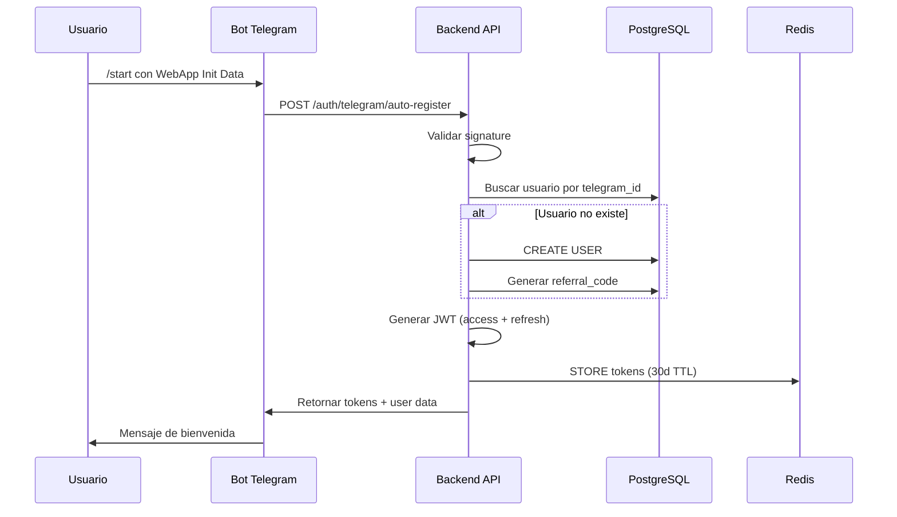
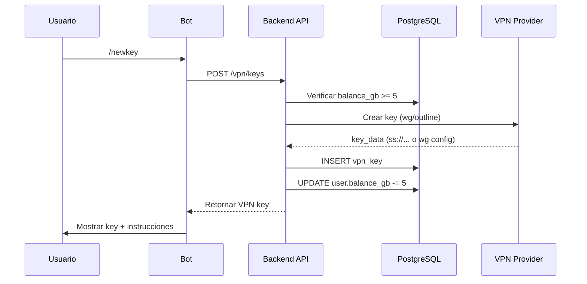
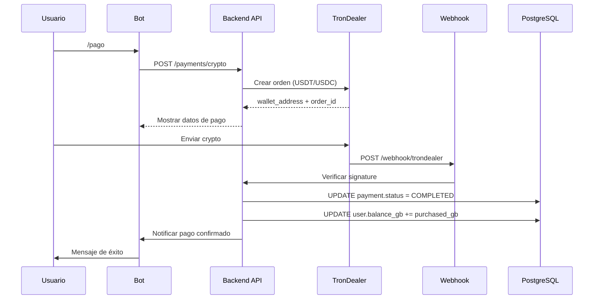

# 🏗️ Arquitectura del Ecosistema uSipipo

> Diagrama de componentes, relaciones y flujos de datos del ecosistema

---

## 📐 Visión General

El ecosistema uSipipo sigue una arquitectura **Clean Architecture / Hexagonal** con separación clara entre dominio, aplicación e infraestructura.

---

## 🗺️ Diagrama de Alto Nivel

```
┌─────────────────────────────────────────────────────────────────────┐
│                         CAPA DE PRESENTACIÓN                        │
├─────────────────────────────────────────────────────────────────────┤
│                                                                     │
│  ┌──────────────┐  ┌──────────────┐  ┌──────────────┐             │
│  │   Landing    │  │   Telegram   │  │   Android    │             │
│  │    Page      │  │     Bot      │  │     App      │             │
│  │  (Flask)     │  │ (PTB + HTTP) │  │  (Flutter)   │             │
│  └──────┬───────┘  └──────┬───────┘  └──────┬───────┘             │
│         │                 │                  │                     │
│         │                 │                  │                     │
│  ┌──────┴─────────────────┴──────────────────┴──────┐             │
│  │              Telegram Mini App                    │             │
│  │                  (Flask)                          │             │
│  └──────────────────────┬────────────────────────────┘             │
│                           │                                        │
└───────────────────────────┼────────────────────────────────────────┤
                            │                                        │
                            ▼                                        │
┌─────────────────────────────────────────────────────────────────────┐
│                         CAPA DE APLICACIÓN                          │
├─────────────────────────────────────────────────────────────────────┤
│                                                                     │
│                  ┌─────────────────────┐                           │
│                  │    Backend API      │                           │
│                  │     (FastAPI)       │                           │
│                  │   Port: 8000        │                           │
│                  └──────────┬──────────┘                           │
│                             │                                       │
│         ┌───────────────────┼───────────────────┐                  │
│         │                   │                   │                  │
│         ▼                   ▼                   ▼                  │
│  ┌─────────────┐    ┌─────────────┐    ┌─────────────┐            │
│  │ Application │    │   Domain    │    │   Shared    │            │
│  │   Services  │    │  Entities   │    │   Utilities │            │
│  │  (29 use    │    │  (usipipo   │    │  (schemas,  │            │
│  │   cases)    │    │   -commons) │    │   config)   │            │
│  └─────────────┘    └─────────────┘    └─────────────┘            │
│                                                                     │
└─────────────────────────────────────────────────────────────────────┤
                            │                                        │
                            ▼                                        │
┌─────────────────────────────────────────────────────────────────────┐
│                        CAPA DE INFRAESTRUCTURA                      │
├─────────────────────────────────────────────────────────────────────┤
│                                                                     │
│  ┌─────────────┐  ┌─────────────┐  ┌─────────────┐                │
│  │ PostgreSQL  │  │    Redis    │  │  WireGuard  │                │
│  │   :5432     │  │   :6379     │  │  Servers    │                │
│  │  (Datos)    │  │  (Cache)    │  │  (VPN)      │                │
│  └─────────────┘  └─────────────┘  └─────────────┘                │
│                                                                     │
│  ┌─────────────┐  ┌─────────────┐  ┌─────────────┐                │
│  │   Outline   │  │  TronDealer │  │  Firebase   │                │
│  │    API      │  │  (Payments) │  │   (FCM)     │                │
│  └─────────────┘  └─────────────┘  └─────────────┘                │
│                                                                     │
└─────────────────────────────────────────────────────────────────────┘
```

---

## 📦 Componentes del Ecosistema

### **1. Frontend / Clientes**

#### **Landing Page (usipipo-landing)**
- **Tech:** Flask 3.1+, Python 3.13
- **Puerto:** 5000
- **Propósito:** Marketing, conversión, documentación
- **Endpoints:** `/`, `/pricing`, `/docs`, `/status`
- **Deploy:** systemd + Caddy reverse proxy

#### **Telegram Bot (usipipo-telegram-bot)**
- **Tech:** python-telegram-bot 22.7, httpx
- **Tipo:** Polling + Webhooks
- **Propósito:** Interface principal de usuario
- **Comandos:** `/start`, `/me`, `/unlink`, `/help`
- **Deploy:** systemd + Redis token storage

#### **MiniApp Web (usipipo-miniapp-web)**
- **Tech:** Flask 3.1+, Python 3.13
- **Puerto:** 5000 (ruta `/miniapp/*`)
- **Propósito:** Web app embebida en Telegram
- **Features:** Gestión de VPN keys, pagos, consumo
- **Deploy:** systemd + Caddy (misma instancia que landing)

#### **Android App (usipipovpnapp)**
- **Tech:** Flutter 3.16, Dart 3.11
- **Protocolos:** WireGuard, Outline (Shadowsocks)
- **Propósito:** Cliente VPN nativo
- **Features:** Conexión VPN, estadísticas, notificaciones
- **Estado:** Fase 2/8 de implementación

---

### **2. Backend API (usipipo-backend)**

#### **Arquitectura: Clean Architecture**

```
src/
├── core/
│   ├── domain/           # Interfaces de dominio
│   ├── application/      # 29 servicios de aplicación
│   └── ports/           # Interfaces de puertos
│
├── infrastructure/
│   ├── api/             # Rutas FastAPI
│   ├── api_clients/     # Clientes HTTP externos
│   ├── jobs/            # Background jobs
│   ├── payment_gateways/ # Integraciones de pago
│   ├── persistence/     # SQLAlchemy + repositorios
│   └── vpn_providers/   # WireGuard + Outline
│
└── shared/
    ├── config/          # Configuración
    ├── schemas/         # Pydantic schemas
    ├── security/        # JWT + seguridad
    └── logger.py        # Logging
```

#### **Módulos Principales:**

| Módulo | Responsabilidad | Endpoints |
|--------|-----------------|-----------|
| **Auth** | Autenticación JWT | `/api/v1/auth/*` |
| **Users** | Gestión de usuarios | `/api/v1/users/*` |
| **VPN Keys** | Generación y gestión | `/api/v1/vpn/keys/*` |
| **Subscriptions** | Suscripciones y planes | `/api/v1/subscriptions/*` |
| **Payments** | Procesamiento de pagos | `/api/v1/payments/*` |
| **Billing** | Facturación por consumo | `/api/v1/billing/*` |
| **Wallets** | Gestión de saldo | `/api/v1/wallets/*` |
| **Tickets** | Soporte al cliente | `/api/v1/tickets/*` |
| **Admin** | Panel administrativo | `/api/v1/admin/*` |

---

### **3. Shared Library (usipipo-commons)**

#### **Propósito:**
Librería compartida publicada en PyPI con entidades y utilidades comunes.

#### **Estructura:**

```
usipipo_commons/
├── domain/
│   ├── entities/        # User, VpnKey, Payment, etc.
│   └── enums/           # KeyType, PaymentStatus, etc.
├── schemas/             # Request/Response schemas
├── constants/           # FREE_GB, PRICE_PER_GB, etc.
└── utils/              # Validation, formatting
```

#### **Entidades Principales:**

| Entidad | Propósito | Campos Clave |
|---------|-----------|--------------|
| **User** | Usuario del sistema | telegram_id, balance_gb, referral_code |
| **VpnKey** | Credencial VPN | key_type, key_data, data_limit_bytes |
| **Payment** | Transacción de pago | amount_usd, method, status |
| **SubscriptionPlan** | Suscripción activa | plan_type, expires_at |
| **ConsumptionBilling** | Ciclo de consumo | mb_consumed, total_cost_usd |
| **DataPackage** | Paquete de datos | package_type, data_limit_bytes |
| **Ticket** | Ticket de soporte | category, priority, status |

---

## 💾 Base de Datos

### **PostgreSQL Schema**

```
┌─────────────────────────────────────────────────────────┐
│                     PostgreSQL 15+                       │
│                     Port: 5432                           │
└─────────────────────────────────────────────────────────┘
                            │
        ┌───────────────────┼───────────────────┐
        │                   │                   │
        ▼                   ▼                   ▼
┌──────────────┐   ┌──────────────┐   ┌──────────────┐
│    users     │   │   vpn_keys   │   │   payments   │
├──────────────┤   ├──────────────┤   ├──────────────┤
│ id (UUID)    │   │ id (UUID)    │   │ id (UUID)    │
│ telegram_id  │   │ user_id (FK) │   │ user_id (FK) │
│ username     │   │ key_type     │   │ amount_usd   │
│ balance_gb   │   │ status       │   │ method       │
│ referral_code│   │ data_limit   │   │ status       │
└──────────────┘   └──────────────┘   └──────────────┘

        │                   │                   │
        ▼                   ▼                   ▼
┌──────────────┐   ┌──────────────┐   ┌──────────────┐
│subscriptions │   │  billing     │   │   tickets    │
├──────────────┤   ├──────────────┤   ├──────────────┤
│ user_id (FK) │   │ user_id (FK) │   │ user_id (FK) │
│ plan_type    │   │ mb_consumed  │   │ category     │
│ expires_at   │   │ total_cost   │   │ status       │
└──────────────┘   └──────────────┘   └──────────────┘
```

### **Tablas Principales (9):**

1. **users** - Usuarios del sistema
2. **vpn_keys** - Credenciales VPN
3. **payments** - Transacciones de pago
4. **data_packages** - Paquetes de datos prepagos
5. **subscription_plans** - Suscripciones activas
6. **subscription_transactions** - Historial de suscripciones
7. **consumption_billings** - Ciclos de facturación por consumo
8. **consumption_invoices** - Invoices de consumo
9. **tickets** - Tickets de soporte
10. **ticket_messages** - Mensajes de tickets
11. **referrals** - Referidos y créditos
12. **wallet_pools** - Pool de saldo compartido
13. **wallets** - carteras de usuarios
14. **devices** - Dispositivos para FCM
15. **auth_providers** - Proveedores de autenticación

---

## 🔌 Integraciones Externas

### **1. TronDealer (Pagos Crypto)**

```
┌─────────────────┐         ┌─────────────────┐
│   uSipipo       │  HTTP   │   TronDealer    │
│   Backend       │ ───────▶│     API v2      │
│                 │         │                 │
│ - Create order  │         │ - Create order  │
│ - Verify payment│         │ - Get status    │
│ - Webhook       │◀────────│ - Webhook       │
└─────────────────┘  HTTP   └─────────────────┘
```

**Endpoints usados:**
- `POST /api/v2/order/create` - Crear orden de pago
- `GET /api/v2/order/status` - Verificar estado
- `POST /webhook/trondealer` - Recepción de eventos

**Redes soportadas:**
- BSC (BEP20)
- Ethereum (ERC20)
- Polygon
- TRON (TRC20)

---

### **2. Telegram**

```
┌─────────────────┐         ┌─────────────────┐
│   Telegram Bot  │  HTTP   │  Telegram API   │
│                 │ ───────▶│                 │
│ - Polling       │         │ - Get updates   │
│ - WebApp        │         │ - Send message  │
│ - Webhooks      │◀────────│ - Bot methods   │
└─────────────────┘  HTTP   └─────────────────┘
```

**APIs usadas:**
- **Bot API** - Mensajes, comandos, keyboards
- **WebApp API** - Mini app embebida
- **Payments API** - Telegram Stars

---

### **3. Firebase Cloud Messaging (FCM)**

```
┌─────────────────┐         ┌─────────────────┐
│   uSipipo       │  HTTP   │   Firebase      │
│   Backend       │ ───────▶│   Cloud         │
│                 │         │   Messaging     │
│ - Send push     │         │ - Deliver push  │
│ - Register token│         │ - Device tokens │
└─────────────────┘         └─────────────────┘
```

**Casos de uso:**
- Notificación de pago confirmado
- Alerta de key por expirar
- Recordatorio de consumo
- Estado de conexión VPN

---

### **4. VPN Providers**

#### **WireGuard (wg-quick)**

```
┌─────────────────┐         ┌─────────────────┐
│   uSipipo       │  CLI    │   WireGuard     │
│   Backend       │ ───────▶│   wg-quick      │
│                 │         │                 │
│ - Generate key  │         │ - wg genkey     │
│ - Create iface  │         │ - wg-quick up   │
│ - Get config    │         │ - wg show       │
└─────────────────┘         └─────────────────┘
```

#### **Outline (Shadowsocks)**

```
┌─────────────────┐         ┌─────────────────┐
│   uSipipo       │  REST   │   Outline API   │
│   Backend       │ ───────▶│   (Shadowsocks) │
│                 │         │                 │
│ - createAccessKey│        │ - POST /keys    │
│ - listKeys      │         │ - GET /keys     │
│ - deleteKey     │         │ - DELETE /keys  │
│ - getMetrics    │         │ - GET /metrics  │
└─────────────────┘  mTLS   └─────────────────┘
```

---

## 🔐 Seguridad

### **Autenticación**

```
┌──────────────┐
│   Usuario    │
└──────┬───────┘
       │ 1. /start (Telegram)
       ▼
┌──────────────┐
│  Telegram    │
│  WebApp Data │
└──────┬───────┘
       │ 2. Validate signature
       ▼
┌──────────────┐
│   Backend    │
│   Auto-reg   │
└──────┬───────┘
       │ 3. JWT (access + refresh)
       ▼
┌──────────────┐
│   Client     │
│   Storage    │
└──────────────┘
```

**Flujo:**
1. Usuario inicia bot con `/start`
2. Backend valida Telegram WebApp Init Data
3. Auto-registra usuario si no existe
4. Genera JWT access token (30 min) + refresh token (30 días)
5. Client almacena en Redis (bot) o flutter_secure_storage (app)
6. Auto-refresh 5 minutos antes de expiración

---

### **Autorización**

**Roles:**
- **user** - Usuario estándar
- **admin** - Administrador con acceso a endpoints admin

**Permisos por rol:**

| Endpoint | user | admin |
|----------|------|-------|
| `/api/v1/users/me` | ✅ Own | ✅ Any |
| `/api/v1/vpn/keys` | ✅ Own | ✅ Any |
| `/api/v1/admin/users` | ❌ | ✅ |
| `/api/v1/admin/keys` | ❌ | ✅ |

---

## 📊 Flujo de Datos

### **Registro de Usuario**



---

### **Generación de VPN Key**



---

### **Pago con Crypto**



---

## 🚀 Deployment

### **Arquitectura de Producción**

```
┌─────────────────────────────────────────────────────────┐
│                     Internet                            │
└───────────────────────┬─────────────────────────────────┘
                        │
                        ▼
┌─────────────────────────────────────────────────────────┐
│                  Caddy Reverse Proxy                    │
│                  usipipo.duckdns.org                    │
│                  TLS Automático                         │
└───────────────────────┬─────────────────────────────────┘
                        │
        ┌───────────────┼───────────────┐
        │               │               │
        ▼               ▼               ▼
┌──────────────┐ ┌──────────────┐ ┌──────────────┐
│ Landing Page │ │  Backend API │ │  MiniApp Web │
│ localhost:   │ │ localhost:   │ │ localhost:   │
│ 5000         │ │ 8000         │ │ 5000/miniapp │
│ systemd      │ │ systemd      │ │ systemd      │
└──────────────┘ └──────────────┘ └──────────────┘

        │               │
        ▼               ▼
┌──────────────┐ ┌──────────────┐
│  PostgreSQL  │ │    Redis     │
│  localhost:  │ │ localhost:   │
│  5432        │ │ 6379         │
│  systemd     │ │ systemd      │
└──────────────┘ └──────────────┘
```

---

### **Servicios systemd**

| Servicio | Unit File | Puerto | Usuario |
|----------|-----------|--------|---------|
| **Landing** | `usipipo-landing.service` | 5000 | usipipo |
| **Backend** | `usipipo-backend.service` | 8000 | usipipo |
| **Bot** | `usipipo-bot.service` | N/A | usipipo |
| **MiniApp** | `usipipo-miniapp.service` | 5001 | usipipo |
| **PostgreSQL** | `postgresql.service` | 5432 | postgres |
| **Redis** | `redis.service` | 6379 | redis |

---

## 📈 Monitoring

### **Stack de Observabilidad**

```
┌─────────────────────────────────────────────────────────┐
│                    Observabilidad                       │
├─────────────────────────────────────────────────────────┤
│                                                         │
│  ┌─────────────┐  ┌─────────────┐  ┌─────────────┐    │
│  │ Prometheus  │  │    Jaeger   │  │   Grafana   │    │
│  │  (Metrics)  │  │   (Tracing) │  │ (Dashboards)│    │
│  └─────────────┘  └─────────────┘  └─────────────┘    │
│                                                         │
└─────────────────────────────────────────────────────────┘
```

**Métricas clave:**
- Request rate por endpoint
- Latencia p50, p95, p99
- Error rate por tipo
- VPN connection success rate
- Payment success rate

---

## 📚 Recursos Relacionados

- [Project Overview](project-overview.md)
- [Technology Stack Overview](../technology/stack-overview.md)
- [Backend API Reference](../apis/backend-api-reference.md)

---

**Última actualización:** 2026-03-27
